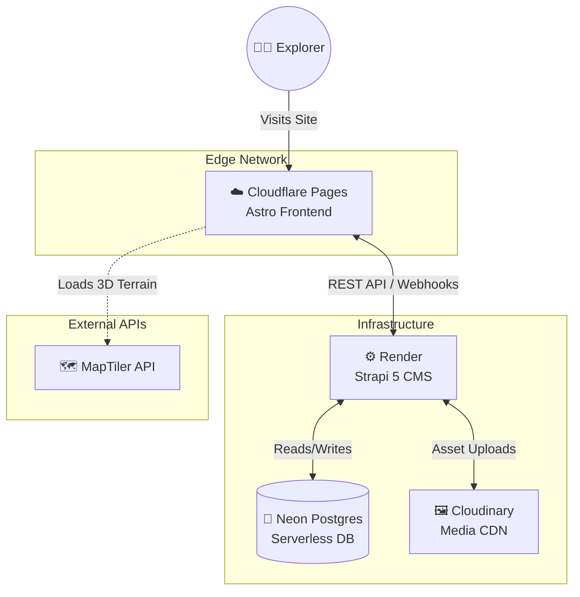
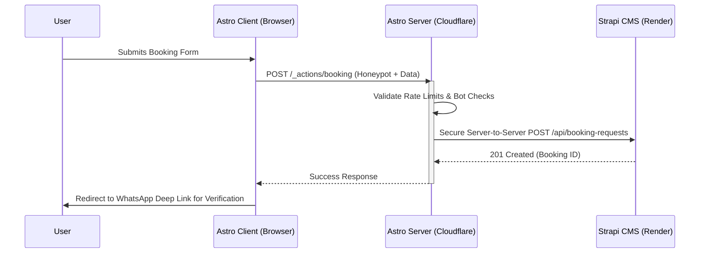

<div align="center">

  

  
  
  <h1 align="center">Dream of The Holy Himalayas</h1>
  <p align="center"><strong>Next-Generation Himalayan Trekking & Expedition Platform</strong></p>

  <p align="center">
    
    
    
    
    
    
  </p>

  <p align="center">
    <a href="https://civil-chaos.pages.dev"></a>
  </p>

  <p align="center">
    <i>Proprietary in-house platform of Dream of The Holy Himalayas — HQ: Village Mautar, Uttarkashi, Uttarakhand</i>
  </p>
</div>

<br />

> **Dream of The Holy Himalayas** is the proprietary booking and storytelling platform of a boutique Himalayan trekking agency. Designed to shatter the traditional "budget tour operator" aesthetic, it pairs a bespoke **Alpine Glass** design system with interactive 3D topography, live trek telemetry HUDs, and a fully CMS-driven content pipeline — every trek, price, and batch is managed by the agency team without a single code deploy.

---

## ✦ Platform Highlights

| | |
|---|---|
| 🏔 **Immersive 3D Terrain** | Draco-compressed GLB mountain models with procedural snowfall, lazy-loaded only when in viewport |
| 🗺 **Interactive Trek Map** | MapLibre GL + MapTiler terrain DEM, trekkable routes with elevation-exaggerated profiles |
| 📱 **Telemetry-Style Storytelling** | Altitude acclimatization lab, fitness readiness quiz, live batch-seat availability |
| 🔒 **Secure Booking Relay** | Bot-hardened form → server-side Strapi write → instant WhatsApp deep link to basecamp |
| ✍️ **Zero-Deploy Content** | All trek data, pricing, itineraries, FAQs, and SEO metadata editable in Strapi admin |
| ⚡ **Edge-Fast Delivery** | Astro hybrid rendering on Cloudflare Pages; marketing pages ship pure HTML, near-zero JS |

---

## 🏗 System Architecture

A decoupled edge architecture: lightning-fast static delivery with secure, serverless data fetching.



### 🔀 Secure Booking Flow

All CMS writes are routed through an Astro Server Action with honeypot checks and per-IP rate limiting — the Strapi token never touches a browser.



---

## 🗂 Inside the Repository

```
civil-chaos/
├── apps/
│   ├── web/                  # Astro 4 frontend — hybrid render, Cloudflare Pages
│   │   ├── src/
│   │   │   ├── pages/        # Home, About, Contact, Trek catalog & detail routes
│   │   │   ├── components/   # Alpine Glass UI: map, 3D viewer, telemetry, booking
│   │   │   ├── actions/      # Serverless booking endpoint (validation + rate limit)
│   │   │   ├── lib/          # Strapi client, Zod response schemas
│   │   │   └── styles/       # Design tokens & glass system
│   │   ├── public/           # GLB terrain models, expedition photography, favicons
│   │   └── tests/            # Playwright E2E for the booking journey
│   └── cms/                  # Strapi 5 headless CMS — Render + Neon Postgres
│       ├── src/api/          # Content types: Trek, Batch, Package, Region, Booking, Settings
│       └── scripts/          # Database seeding for reproducible environments
├── docs/                     # Engineering specs (see below)
├── DESIGN.md                 # Alpine Glass design-system contract
├── AGENTS.md                 # Project guardrails & locked architectural decisions
├── render.yaml               # CMS infrastructure-as-code (Render blueprint)
└── package.json              # npm workspaces orchestrating web + cms
```

### 📐 Engineering Standards

Every subsystem is spec-driven:

| Spec | Covers |
|---|---|
| [docs/PRD.md](docs/PRD.md) | Goals, scope, users, phases |
| [docs/ARCHITECTURE.md](docs/ARCHITECTURE.md) | Stack, infra, env vars, deploy topology |
| [docs/DATABASE_SCHEMA.md](docs/DATABASE_SCHEMA.md) | Strapi content types & relations |
| [docs/API_CONTRACT.md](docs/API_CONTRACT.md) | REST endpoints, webhooks, error semantics |
| [docs/MAP_COMPONENT_SPEC.md](docs/MAP_COMPONENT_SPEC.md) | Interactive trek map |
| [docs/FRONTEND_DESIGN_SPEC.md](docs/FRONTEND_DESIGN_SPEC.md) | Pages & Alpine Glass design system |
| [docs/BOOKING_FLOW.md](docs/BOOKING_FLOW.md) | Booking validation & notification flow |

---

<p align="center">
  <i>🔒 This repository is a public showcase of proprietary software.</i><br/>
  <i>All rights reserved by Dream of The Holy Himalayas — see <a href="LICENSE">LICENSE</a>.</i>
</p>
