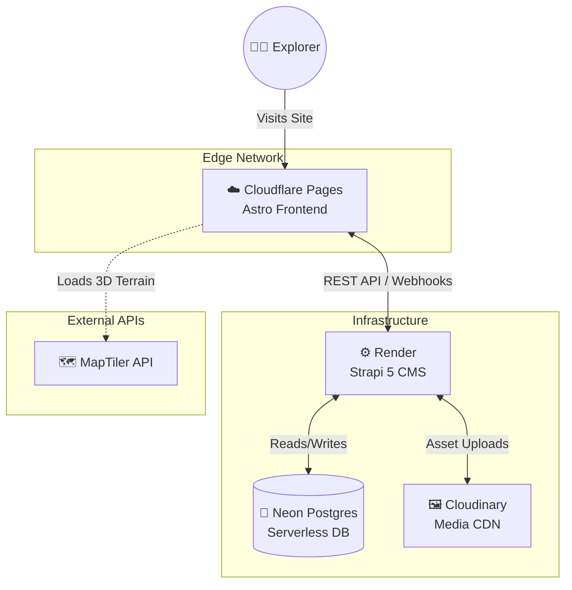
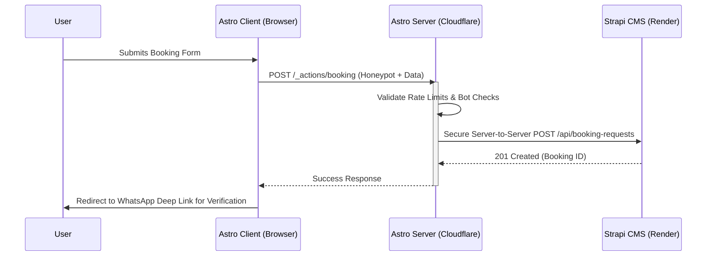

<div align="center">

  

  
  
  <h1 align="center">Dream of The Holy Himalayas</h1>
  <p align="center"><strong>Next-Generation Himalayan Trekking & Expedition Platform</strong></p>

  <p align="center">
    
    
    
    
    
    
  </p>

  <p align="center">
    <i>HQ: Village Mautar, Uttarkashi, Uttarakhand</i>
  </p>
</div>

<br />

> **Dream of The Holy Himalayas** is a premium, high-performance web platform built for a boutique trekking agency. Designed to shatter the traditional "budget tour operator" aesthetic, this platform utilizes a bespoke **Alpine Glass** design system, cinematic dark-mode interfaces, interactive 3D topography, and real-time telemetry HUDs.

---


## 🏗 System Architecture

The platform operates on a decoupled edge-architecture, ensuring lightning-fast static delivery with secure, serverless data fetching.



### 🔀 Secure Booking Flow (Phase 1)

All Strapi write operations are routed securely through an Astro Server Action, completely hiding the Strapi API tokens from the client browser.



---

## 🚀 Local Development

### Prerequisites
* Node.js 20+
* NPM Workspace Support

### 1. Installation
Clone the repository and install dependencies from the root directory:
```bash
git clone https://github.com/anubhavaanand/civil-chaos.git
cd civil-chaos
npm install
```

### 2. Environment Setup
You will need to configure environment variables for both the frontend and the CMS. 
```bash
cp apps/web/.env.example apps/web/.env
cp apps/cms/.env.example apps/cms/.env
```

### 3. Running the Stack
Run the entire monorepo concurrently:
```bash
npm run dev
```
* **Astro Frontend:** [http://localhost:4321](http://localhost:4321)
* **Strapi Admin Panel:** [http://localhost:1337/admin](http://localhost:1337/admin)

---
<p align="center">
  <i>Proprietary software. All rights reserved by Dream of The Holy Himalayas.</i>
</p>
