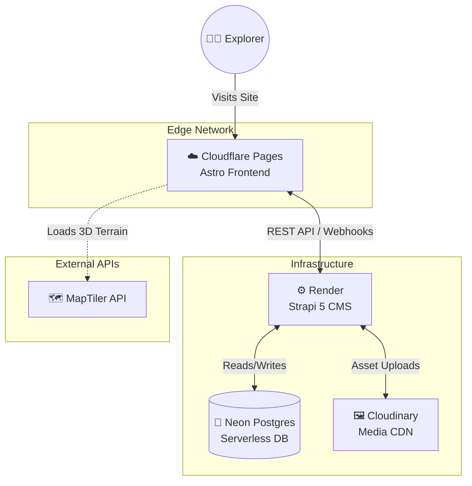
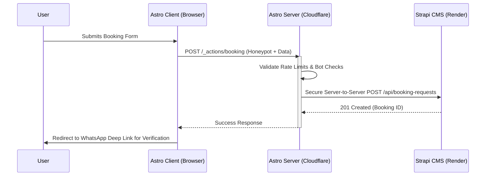

<div align="center">

  

  
  
  <h1 align="center">Dream of The Holy Himalayas</h1>
  <p align="center"><strong>Next-Generation Himalayan Trekking & Expedition Platform</strong></p>

  <p align="center">
    
    
    
    
    
    
  </p>

  <p align="center">
    <a href="https://civil-chaos.pages.dev"></a>
  </p>

  <p align="center">
    <i>HQ: Village Mautar, Uttarkashi, Uttarakhand</i>
  </p>
</div>

<br />

> **Dream of The Holy Himalayas** is a premium, high-performance web platform built for a boutique trekking agency. Designed to shatter the traditional "budget tour operator" aesthetic, this platform utilizes a bespoke **Alpine Glass** design system, cinematic dark-mode interfaces, interactive 3D topography, and real-time telemetry HUDs.

---


## 🏗 System Architecture

The platform operates on a decoupled edge-architecture, ensuring lightning-fast static delivery with secure, serverless data fetching.



### 🔀 Secure Booking Flow (Phase 1)

All Strapi write operations are routed securely through an Astro Server Action, completely hiding the Strapi API tokens from the client browser.



---

## 🚀 Local Development

### Prerequisites
* Node.js 20+
* NPM Workspace Support

### 1. Installation
Clone the repository and install dependencies from the root directory:
```bash
git clone https://github.com/anubhavaanand/civil-chaos.git
cd civil-chaos
npm install
```

### 2. Environment Setup
You will need to configure environment variables for both the frontend and the CMS. 
```bash
cp apps/web/.env.example apps/web/.env
cp apps/cms/.env.example apps/cms/.env
```

### 3. Running the Stack
The frontend and CMS run as separate processes — use two terminals:
```bash
npm run dev                             # Astro frontend → http://localhost:4321
npm run develop --workspace=apps/cms    # Strapi → http://localhost:1337/admin
```

---

## 🗂 Project Layout

```
apps/web      Astro 4 frontend (hybrid output, Cloudflare Pages)
apps/cms      Strapi 5 headless CMS (Render + Neon Postgres)
docs/         Specs: PRD, architecture, schema, API contract, design system
```

| Spec | Covers |
|---|---|
| [docs/PRD.md](docs/PRD.md) | Goals, scope, users, phases |
| [docs/ARCHITECTURE.md](docs/ARCHITECTURE.md) | Stack, infra, env vars, deploy |
| [docs/DATABASE_SCHEMA.md](docs/DATABASE_SCHEMA.md) | Strapi content types |
| [docs/API_CONTRACT.md](docs/API_CONTRACT.md) | REST endpoints, webhooks |
| [docs/MAP_COMPONENT_SPEC.md](docs/MAP_COMPONENT_SPEC.md) | Interactive trek map |
| [docs/FRONTEND_DESIGN_SPEC.md](docs/FRONTEND_DESIGN_SPEC.md) | Pages & Alpine Glass design system |
| [docs/BOOKING_FLOW.md](docs/BOOKING_FLOW.md) | Booking validation & notifications |

Contributions welcome from contracted collaborators — see [CONTRIBUTING.md](CONTRIBUTING.md) and the [issue templates](../../issues/new/choose).

---
<p align="center">
  <i>Proprietary software — see <a href="LICENSE">LICENSE</a>. All rights reserved by Dream of The Holy Himalayas.</i>
</p>
